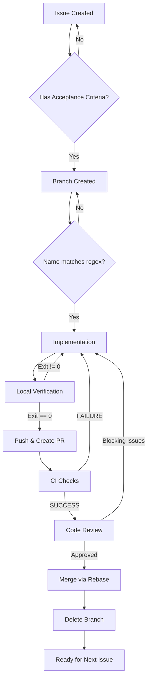

# Self-Manageable Software Development Workflow

This document defines the explicit workflow for software development, ensuring consistency, quality, and manageability for teams of any size (from 1 to N).

**AUTHORITY**: This workflow is non-negotiable. Deviations require explicit justification documented in the Issue or PR.

---

## Prerequisites

Before following this workflow, verify the following tools are installed and configured:

| Tool | Verification Command | Expected Output | Failure Action |
|------|---------------------|-----------------|----------------|
| Git | `git --version` | `git version X.Y.Z` | Install Git |
| GitHub CLI | `gh auth status` | Contains "Logged in" | Run `gh auth login` |
| Repository Access | `git push --dry-run origin master 2>&1` | Exit code 0 | Fix permissions |

**Verification Script:**
```bash
#!/bin/bash
set -e
git --version || { echo "FAIL: Git not installed"; exit 1; }
gh auth status 2>&1 | grep -q "Logged in" || { echo "FAIL: Not authenticated"; exit 1; }
git push --dry-run origin master 2>&1 || { echo "FAIL: No push access"; exit 1; }
echo "PASS: All prerequisites met"
```

**BLOCKING**: Exit code != 0 halts workflow.

---

## Core Principles

1. **Traceability**: Every line of code MUST be traceable to an Issue. No code change exists without a corresponding Issue.
2. **Linear History**: We use **Rebase** exclusively. Merge commits are NEVER allowed.
3. **Automation**: CLI tools (`gh`, `git`) over GUI. No exceptions.
4. **Objectivity**: Reviews based on defined criteria only. Opinion-based feedback is non-blocking.
5. **Communication**: Serious, concise, professional. No emojis. No ambiguity.
6. **Single Responsibility**: One Issue = One PR = One context. Violations require Issue split.

---

## Development Cycle

### Phase 1: Synchronization & Task Definition

**Objective:** Guarantee local repository is synchronized and work is defined in a trackable Issue.

**Steps:**

| Step | Action | Command | Validation |
|------|--------|---------|------------|
| 1.1 | Switch to master | `git checkout master` | Exit code 0 |
| 1.2 | Pull latest | `git pull origin master` | Exit code 0 |
| 1.3 | Verify sync | `git rev-parse HEAD` vs `git rev-parse origin/master` | Must match |
| 1.4 | List assigned issues | `gh issue list --assignee "@me" --state open --json number,title` | JSON output |
| 1.5 | Create issue (if needed) | See Issue Creation below | Issue number returned |

**Issue Creation Command:**
```bash
gh issue create \
  --title "<type>: <description>" \
  --body "## Problem / Feature
<description>

## Acceptance Criteria
- [ ] <criterion-1>
- [ ] <criterion-2>

## Technical Notes
<notes>"
```

**Issue Title Format (regex):** `^(feat|fix|chore|refactor|docs): .{10,72}$`

**Exit Criteria:**
- [ ] `git rev-parse HEAD` equals `git rev-parse origin/master`
- [ ] Issue exists with at least one Acceptance Criterion checkbox
- [ ] Issue number captured: `ISSUE_NUMBER=<number>`

**GATE Validation:**
```bash
ISSUE_BODY=$(gh issue view $ISSUE_NUMBER --json body -q '.body')
echo "$ISSUE_BODY" | grep -qE "^\s*- \[ \]" || { echo "FAIL: No acceptance criteria"; exit 1; }
```

---

### Phase 2: Branching

**Objective:** Establish a dedicated branch linked to a single Issue.

**Naming Convention:** `<issue-number>-<type>-<short-description>`

**Format Validation (regex):** `^[0-9]+-(?:feat|fix|chore|refactor|docs)-[a-z0-9-]{3,30}$`

**Valid Types:**
| Type | Description |
|------|-------------|
| `feat` | New feature |
| `fix` | Bug fix |
| `chore` | Maintenance tasks |
| `refactor` | Code restructuring without behavior change |
| `docs` | Documentation changes |

**Command:**
```bash
BRANCH_NAME="${ISSUE_NUMBER}-<type>-<short-description>"
echo "$BRANCH_NAME" | grep -qE "^[0-9]+-(?:feat|fix|chore|refactor|docs)-[a-z0-9-]{3,30}$" || { echo "FAIL: Invalid branch name"; exit 1; }
git checkout -b "$BRANCH_NAME"
```

**Exit Criteria:**
- [ ] `git branch --show-current` matches naming regex
- [ ] `git log --oneline master..HEAD` returns empty (branch just created)
- [ ] Branch name contains exactly one Issue number

**GATE Validation:**
```bash
CURRENT=$(git branch --show-current)
echo "$CURRENT" | grep -qE "^[0-9]+-" || { echo "FAIL: Branch must start with issue number"; exit 1; }
```

---

### Phase 3: Implementation & Committing

**Objective:** Implement the solution with atomic, well-documented commits.

**Commit Format (Conventional Commits):** `<type>(<scope>): <subject>`

**Format Validation (regex):** `^(feat|fix|docs|style|refactor|test|chore)\([a-z0-9-]+\): .{10,72}$`

**Commit Types:**
| Type | Purpose | Version Impact |
|------|---------|----------------|
| `feat` | New feature | Minor |
| `fix` | Bug fix | Patch |
| `docs` | Documentation only | None |
| `style` | Formatting, no code change | None |
| `refactor` | Code restructuring | None |
| `test` | Adding or modifying tests | None |
| `chore` | Maintenance | None |

**Commit Rules:**
1. Each commit represents a single logical change.
2. Do not mix different types in one commit.
3. Use selective staging (`git add <file>`) when changes span multiple contexts.
4. Maximum 50 characters for subject line summary.

**Commands:**
```bash
git add <file1> <file2>
COMMIT_MSG="<type>(<scope>): <subject>"
echo "$COMMIT_MSG" | grep -qE "^(feat|fix|docs|style|refactor|test|chore)\([a-z0-9-]+\): .{10,72}$" || { echo "FAIL: Invalid commit format"; exit 1; }
git commit -m "$COMMIT_MSG"
```

**Exit Criteria:**
- [ ] All commits on branch match format regex: `git log --oneline master..HEAD --format="%s"`
- [ ] Each commit touches files related to single context
- [ ] No commits with message containing "WIP", "fixup", or "squash"

---

### Phase 4: Self-Review & Verification

**Objective:** Validate implementation locally before requesting review.

**Verification Checklist:**
| Check | Command | Success Criteria | Required |
|-------|---------|------------------|----------|
| Build | Project-specific | Exit code 0 | Yes |
| Tests | Project-specific | Exit code 0, 0 failures | Yes |
| Lint | Project-specific | Exit code 0, 0 errors | Yes |
| New tests exist | See below | At least 1 new test file for feat/fix | Yes (feat/fix) |

**New Test Verification (for feat/fix):**
```bash
CHANGED_TEST_FILES=$(git diff --name-only master..HEAD | grep -E "\.(test|spec)\.[jt]sx?$|_test\.go$|test_.*\.py$" | wc -l)
[ "$CHANGED_TEST_FILES" -gt 0 ] || { echo "FAIL: No test files modified"; exit 1; }
```

**Exit Criteria:**
- [ ] Build command exits with code 0
- [ ] Test command exits with code 0
- [ ] Lint command exits with code 0
- [ ] For feat/fix: `$CHANGED_TEST_FILES > 0`

**GATE**: All exit codes must be 0. No exceptions.

---

### Phase 5: Pull Request (PR)

**Objective:** Create a reviewable PR linked to the Issue.

**Steps:**

| Step | Action | Command | Validation |
|------|--------|---------|------------|
| 5.1 | Push branch | `git push -u origin HEAD` | Exit code 0 |
| 5.2 | Create PR | See below | PR URL returned |
| 5.3 | Verify CI started | `gh run list --branch $(git branch --show-current) --limit 1` | Run exists |

**PR Creation Command:**
```bash
gh pr create \
  --title "<type>(<scope>): <subject>" \
  --body "## Related Issue
Closes #${ISSUE_NUMBER}

## Type of Change
- [x] <type>

## Summary
<description>

## Verification Checklist
- [x] Code follows project style guidelines
- [x] Self-review completed
- [x] Tests added for new functionality
- [x] All tests pass locally
- [x] CI checks pass"
```

**PR Title Format (regex):** `^(feat|fix|docs|style|refactor|test|chore)\([a-z0-9-]+\): .{10,72}$`

**Exit Criteria:**
- [ ] `gh pr view --json url` returns valid URL
- [ ] PR body contains `Closes #<issue-number>`
- [ ] `gh run list` shows at least one run for current branch

**GATE Validation:**
```bash
PR_BODY=$(gh pr view --json body -q '.body')
echo "$PR_BODY" | grep -qE "Closes #[0-9]+" || { echo "FAIL: PR must reference issue"; exit 1; }
```

---

### Phase 6: Code Review

**Objective:** Validate PR meets objective quality criteria.

**Review Checklist:**
| Criterion | Validation Command | Blocking |
|-----------|-------------------|----------|
| Functionality | Manual verification against Acceptance Criteria | Yes |
| CI Status | `gh pr checks --json state -q '.[].state' \| grep -v SUCCESS` returns empty | Yes |
| Commit History | All commits match format regex | Yes |
| Test Coverage | New tests exist for feat/fix | Yes |
| Simplicity | Subjective assessment | No |

**Review Commands:**
```bash
# Checkout PR locally
gh pr checkout <pr-number>

# Verify CI status (all must be SUCCESS)
gh pr checks --json state -q '.[].state' | sort -u
# Expected output: SUCCESS (only)

# Approve PR
gh pr review --approve --body "LGTM: All criteria met."

# Request changes (blocking issues only)
gh pr review --request-changes --body "Blocking: <specific issue with line reference>"
```

**For Solo Teams:**
- Self-review is mandatory.
- Document self-review: `gh pr comment --body "Self-review completed. Checklist verified."`

**Exit Criteria:**
- [ ] `gh pr checks` shows all SUCCESS
- [ ] PR has at least one approval
- [ ] No unresolved review comments with "Blocking:" prefix

---

### Phase 7: Integration (Merge)

**Objective:** Integrate changes into master with clean history.

**Pre-Merge Verification:**
```bash
git fetch origin master
git rebase origin/master

# If conflicts exist:
# 1. Resolve each file
# 2. git add <resolved-file>
# 3. git rebase --continue
# 4. Repeat until complete

git push --force-with-lease
```

**Merge Command:**
```bash
gh pr merge --rebase --delete-branch
```

**Post-Merge Validation:**
```bash
# Verify no merge commits
git log --oneline --merges origin/master~10..origin/master | wc -l
# Expected: 0
```

**Exit Criteria:**
- [ ] `gh pr view --json state -q '.state'` returns "MERGED"
- [ ] `git branch -r | grep <branch-name>` returns empty (remote deleted)
- [ ] Merge commit count remains 0

---

### Phase 8: Cleanup

**Objective:** Maintain clean local environment.

**Commands:**
```bash
git checkout master
git pull origin master
git branch -D <branch-name>
git remote prune origin
```

**Exit Criteria:**
- [ ] `git branch --show-current` returns "master"
- [ ] `git rev-parse HEAD` equals `git rev-parse origin/master`
- [ ] `git branch | grep <branch-name>` returns empty
- [ ] No stale remote-tracking branches

---

## Decision Trees

### When to Create an Issue

```
Is there a code change needed?
├── Yes → Does an Issue exist for this change?
│   ├── Yes → Use existing Issue
│   └── No → Create new Issue with Acceptance Criteria
└── No → No Issue needed
```

### When to Split Work

```
Does the task require multiple types of changes?
├── feat + refactor → Create separate Issues
├── feat + test → Single Issue (tests are part of feat)
├── fix + docs → Single Issue (docs explain fix)
└── refactor + refactor → Single Issue (same type)
```

### Handling Conflicts During Rebase

```
Conflict detected during rebase?
├── Yes → For each conflicting file:
│   ├── Open file, resolve conflict markers
│   ├── git add <file>
│   ├── git rebase --continue
│   └── If unresolvable: git rebase --abort, reassess approach
└── No → Proceed with push
```

---

## Templates

### Issue Template

```markdown
## Problem / Feature
<!-- Concise description: what needs to be solved or added -->

## Acceptance Criteria
<!-- Definition of Done - Specific and Testable -->
- [ ] <criterion-1: measurable outcome>
- [ ] <criterion-2: measurable outcome>

## Technical Notes
<!-- Optional: constraints, dependencies, approach suggestions -->
```

### Pull Request Template

```markdown
## Related Issue
Closes #<issue-number>

## Type of Change
- [ ] feat: New feature
- [ ] fix: Bug fix
- [ ] refactor: Code restructuring
- [ ] docs: Documentation
- [ ] chore: Maintenance

## Summary
<!-- What was implemented and why -->

## Verification Checklist
- [ ] Code follows project style guidelines
- [ ] Self-review completed
- [ ] Tests added for new functionality
- [ ] All tests pass locally
- [ ] CI checks pass
```

---

## Quick Reference

| Phase | Key Command | Exit Gate Validation |
|-------|-------------|---------------------|
| 1. Sync | `git pull origin master` | `git rev-parse HEAD` == `origin/master` |
| 2. Branch | `git checkout -b <branch>` | Branch name matches regex |
| 3. Commit | `git commit -m "<msg>"` | Message matches regex |
| 4. Verify | `<build> && <test> && <lint>` | All exit code 0 |
| 5. PR | `gh pr create` | PR URL exists, CI triggered |
| 6. Review | `gh pr review --approve` | All checks SUCCESS |
| 7. Merge | `gh pr merge --rebase` | State = MERGED |
| 8. Cleanup | `git branch -D <branch>` | Branch not found locally |

---

## Validation Regex Summary

| Element | Regex Pattern |
|---------|---------------|
| Issue Title | `^(feat\|fix\|chore\|refactor\|docs): .{10,72}$` |
| Branch Name | `^[0-9]+-(?:feat\|fix\|chore\|refactor\|docs)-[a-z0-9-]{3,30}$` |
| Commit Message | `^(feat\|fix\|docs\|style\|refactor\|test\|chore)\([a-z0-9-]+\): .{10,72}$` |
| PR Title | `^(feat\|fix\|docs\|style\|refactor\|test\|chore)\([a-z0-9-]+\): .{10,72}$` |

---

## Visual Summary

