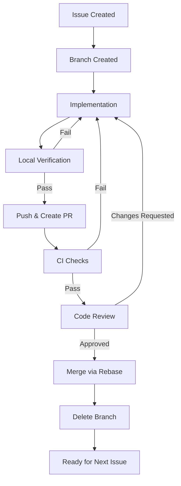

# Self-Manageable Software Development Workflow

This document defines the explicit workflow for software development, ensuring consistency, quality, and manageability for teams of any size (from 1 to N).

## Prerequisites

Before following this workflow, ensure the following tools are installed and configured:

-   **Git**: Version control system.
-   **GitHub CLI (`gh`)**: Authenticated with `gh auth login`.
-   **Repository Access**: Push permissions to the remote repository.

## Core Principles

1.  **Traceability**: Every line of code must be traceable to an Issue. No code change exists without a corresponding Issue.
2.  **Linear History**: We use **Rebase** to maintain a clean, linear project history. Merge commits are not allowed.
3.  **Automation**: We prefer CLI tools (`gh`, `git`) over GUI actions to reduce friction and context switching.
4.  **Objectivity**: Code reviews and merges are based on defined criteria, not opinions.
5.  **Communication**: Maintain a serious, concise, and professional tone. **No emojis** in commits, issues, or PRs.
6.  **Single Responsibility**: One Issue per task. One PR per Issue. One context per commit.

---

## Development Cycle

### Phase 1: Synchronization & Task Definition

Before starting any work, ensure your environment is up-to-date and the task is clearly defined.

**Objective:** Guarantee local repository is synchronized and work is defined in a trackable Issue.

**Steps:**

| Step | Action | Command |
|------|--------|---------|
| 1.1 | Switch to master branch | `git checkout master` |
| 1.2 | Pull latest changes | `git pull origin master` |
| 1.3 | List assigned issues | `gh issue list --assignee "@me"` |
| 1.4 | Create issue (if needed) | `gh issue create --title "<type>: <description>" --body "<body>"` |

**Exit Criteria:**
- [ ] Local master is synchronized with remote.
- [ ] An Issue exists with clear Acceptance Criteria.
- [ ] Issue number is noted for branch naming.

---

### Phase 2: Branching

Create an isolated environment for your task.

**Objective:** Establish a dedicated branch linked to a single Issue.

**Naming Convention:** `<issue-number>-<type>-<short-description>`

**Valid Types:**
| Type | Description |
|------|-------------|
| `feat` | New feature |
| `fix` | Bug fix |
| `chore` | Maintenance tasks |
| `refactor` | Code restructuring without behavior change |
| `docs` | Documentation changes |

**Command:**
```bash
git checkout -b <issue-number>-<type>-<short-description>
# Example: git checkout -b 123-feat-user-login
```

**Exit Criteria:**
- [ ] Branch created from latest master.
- [ ] Branch name follows naming convention.
- [ ] Branch is linked to exactly one Issue.

---

### Phase 3: Implementation & Committing

Work on your branch. Commit often locally.

**Objective:** Implement the solution with atomic, well-documented commits.

**Commit Format (Conventional Commits):**
```
<type>(<scope>): <subject>
```

**Commit Types:**
| Type | Purpose | Version Impact |
|------|---------|----------------|
| `feat` | New feature | Minor |
| `fix` | Bug fix | Patch |
| `docs` | Documentation only | None |
| `style` | Formatting, no code change | None |
| `refactor` | Code restructuring | None |
| `test` | Adding or modifying tests | None |
| `chore` | Maintenance | None |

**Commit Rules:**
1. Each commit must represent a single logical change.
2. Do not mix different types in one commit.
3. Use selective staging (`git add <file>`) when changes span multiple contexts.

**Commands:**
```bash
# Stage specific files
git add <file1> <file2>

# Commit with message
git commit -m "<type>(<scope>): <subject>"

# Example
git commit -m "feat(auth): implement jwt token generation"
```

**Exit Criteria:**
- [ ] Each commit follows Conventional Commits format.
- [ ] Each commit is atomic (single context).
- [ ] Commit history is readable and logical.

---

### Phase 4: Self-Review & Verification

**Before** opening a PR, you must guarantee quality.

**Objective:** Validate implementation locally before requesting review.

**Verification Checklist:**
| Check | Command (adjust per project) | Required |
|-------|------------------------------|----------|
| Code compiles/builds | `npm run build` / `go build` / `dotnet build` | Yes |
| Tests pass | `npm test` / `pytest` / `go test ./...` | Yes |
| Linting passes | `npm run lint` / `eslint .` | Yes |
| New tests added | Manual verification | Yes (for feat/fix) |

**Commands:**
```bash
# Run full verification (example for Node.js)
npm run build
npm test
npm run lint
```

**Exit Criteria:**
- [ ] Build succeeds with no errors.
- [ ] All existing tests pass.
- [ ] New tests cover the changes (for feat/fix).
- [ ] No linting errors.

---

### Phase 5: Pull Request (PR)

Publish your changes for review.

**Objective:** Create a reviewable PR linked to the Issue.

**Steps:**

| Step | Action | Command |
|------|--------|---------|
| 5.1 | Push branch | `git push -u origin HEAD` |
| 5.2 | Create PR | `gh pr create --title "<type>(<scope>): <subject>" --body "Closes #<issue-number>. <description>"` |
| 5.3 | Monitor CI | `gh run watch` |

**PR Title Format:** Must match the primary commit type.

**PR Body Requirements:**
- Must reference the Issue with `Closes #<issue-number>`.
- Must describe what was implemented.

**Exit Criteria:**
- [ ] Branch pushed to remote.
- [ ] PR created with correct title format.
- [ ] PR body references the Issue.
- [ ] CI pipeline triggered.

---

### Phase 6: Code Review

Review based on **facts**, not opinions.

**Objective:** Validate PR meets objective quality criteria.

**Review Checklist:**
| Criterion | Question | Blocking |
|-----------|----------|----------|
| Functionality | Does it meet the Issue's Acceptance Criteria? | Yes |
| CI Status | Do all automated checks pass? | Yes |
| Commit History | Are commits atomic and follow Conventional Commits? | Yes |
| Test Coverage | Are new changes covered by tests? | Yes |
| Simplicity | Is the implementation as simple as possible? | No |

**Review Commands:**
```bash
# Checkout PR locally for testing
gh pr checkout <pr-number>

# Approve PR
gh pr review --approve --body "LGTM: All criteria met."

# Request changes
gh pr review --request-changes --body "Blocking: <specific issue>"
```

**For Solo Teams:**
- Self-review is mandatory.
- Complete the review checklist before merging.
- Document the self-review in the PR.

**Exit Criteria:**
- [ ] All review criteria validated.
- [ ] PR approved (self or peer).
- [ ] All CI checks pass.

---

### Phase 7: Integration (Merge)

Merge using **Rebase** to maintain linear history.

**Objective:** Integrate changes into master with clean history.

**Pre-Merge Verification:**
```bash
# Ensure branch is up-to-date with master
git fetch origin master
git rebase origin/master

# Resolve conflicts if any, then force push
git push --force-with-lease
```

**Merge Command:**
```bash
gh pr merge --rebase --delete-branch
```

**Exit Criteria:**
- [ ] PR merged via rebase.
- [ ] Remote branch deleted.
- [ ] No merge commits created.

---

### Phase 8: Cleanup

Remove local artifacts to keep workspace clean.

**Objective:** Maintain clean local environment.

**Commands:**
```bash
git checkout master
git pull origin master
git branch -D <branch-name>
```

**Exit Criteria:**
- [ ] Local master updated.
- [ ] Local feature branch deleted.
- [ ] Workspace ready for next task.

---

## Decision Trees

### When to Create an Issue

```
Is there a code change needed?
├── Yes → Does an Issue exist for this change?
│   ├── Yes → Use existing Issue
│   └── No → Create new Issue
└── No → No Issue needed
```

### When to Split Work

```
Does the task require multiple types of changes (feat + refactor)?
├── Yes → Create separate Issues for each type
└── No → Single Issue is sufficient
```

### Handling Conflicts During Rebase

```
Conflict detected during rebase?
├── Yes → Resolve conflicts manually
│   ├── Stage resolved files: git add <file>
│   ├── Continue rebase: git rebase --continue
│   └── If stuck: git rebase --abort (start over)
└── No → Proceed with merge
```

---

## Templates

### Issue Template

```markdown
## Problem / Feature
<!-- Concise description of what needs to be solved or added -->

## Acceptance Criteria
<!-- Definition of Done - Specific and Testable -->
- [ ] Criterion 1
- [ ] Criterion 2

## Technical Notes
<!-- Optional: Implementation details, constraints, dependencies -->
```

### Pull Request Template

```markdown
## Related Issue
Closes #<issue-number>

## Type of Change
- [ ] feat: New feature
- [ ] fix: Bug fix
- [ ] refactor: Code restructuring
- [ ] docs: Documentation
- [ ] chore: Maintenance

## Summary
<!-- Brief description of changes -->

## Verification Checklist
- [ ] Code follows project style guidelines
- [ ] Self-review completed
- [ ] Tests added for new functionality
- [ ] All tests pass locally
- [ ] CI checks pass
```

---

## Quick Reference

| Phase | Key Command | Exit Gate |
|-------|-------------|-----------|
| 1. Sync | `git pull origin master` | Local synced, Issue exists |
| 2. Branch | `git checkout -b <branch>` | Branch created |
| 3. Commit | `git commit -m "<msg>"` | Atomic commits |
| 4. Verify | `npm test` | All checks pass |
| 5. PR | `gh pr create` | PR created, CI running |
| 6. Review | `gh pr review --approve` | PR approved |
| 7. Merge | `gh pr merge --rebase` | Merged, branch deleted |
| 8. Cleanup | `git branch -D <branch>` | Local cleaned |

---

## Visual Summary

